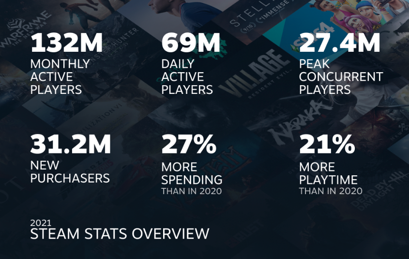

    

# P12 Airdrop

Project Twelve is a GameFi ecosystem with sustainable economies. We believe that "gaming" is an integral part of the
Metaverse, where gamers and developers are the two most important components.

Steam, as a premier gaming platform, is the largest digital distribution platform for PC gaming; players spent almost 38
billion hours on Steam in 2021.

We believe it will be a good means to identify game lovers with the help of Steam data, and we want to give tributes to
all Steam gamers and developers!

## For Developers

### Airdrop Tributes

1. Developer-specific NFT.
2. P12 tokens.

### Mechanism

Through the Steam API, we get a list of all Steam games with their app ID, names, reviews, etc., and we use the
signature method to determine the ownership between developers and games.

Here are the rules and the results:

Steam game developers who:

1. Own at least 1 game on Steam (except DLC).
2. Complete the authentication steps on P12 Airdrop website.

will be rewarded with tributes according to the following rules:

1. Each verified game will get 1 developer-specific NFT.
2. The NFT has 4 categories: legendary, epic, rare, and uncommon.
3. The amount of tokens that developers can claim is based on their games' reviews and publish date.

## For Gamers

### Airdrop Tributes

1. Gamer-specific NFT.
2. P12 tokens.

### Mechanism

Sign in with a Steam account and set "My profile" to "Public," we get the account data including the avatar, a games
array, total playtime, etc., and the gaming experience will determine the rewards.

Here are the rules and the results:

Steam gamers who:

1. Own a Steam account.
2. Complete the authentication steps on P12 Airdrop website.

will be rewarded with tributes according to the following rules:

1. Each Steam account will get 1 Gamer specific NFT.
2. The NFT has 5 categories: legendary, epic, rare, uncommon and common.
3. The amount of tokens that gamers can claim is based on their game hours and account vintage.

## Result Files

We export the results to a public Google
folder [here](https://drive.google.com/drive/folders/1jKYEUQvfKuJcV84pWSdH96XO05HC4zPs).

Game data is available and complete, while binding relationships between the game and address will be continuously
updated.
